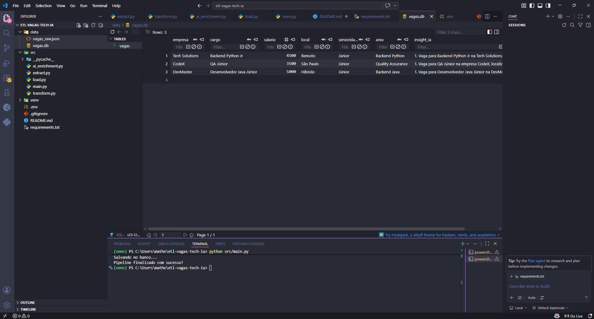

# 🚀 ETL Inteligente de Vagas Tech com IA

Projeto de pipeline de dados (ETL) que utiliza Python e OpenAI para enriquecer automaticamente informações de vagas de tecnologia com Inteligência Artificial.

---

## 📊 Demonstração



---

## 🧠 Sobre o projeto

Este projeto simula um pipeline real de engenharia de dados:

- 📥 Extração de dados de vagas (JSON)
- 🔄 Transformação com Pandas
- 🤖 Enriquecimento com IA (OpenAI API)
- 💾 Armazenamento em SQLite

---

## ⚙️ Arquitetura

Extract → Transform → AI Enrichment → Load (SQLite)

---

## 🚀 Resultado final

Cada vaga contém:

- Empresa
- Cargo
- Salário
- Local
- Senioridade (calculada)
- Área de atuação
- Insight gerado por IA

---

## 🛠️ Tecnologias

- Python
- Pandas
- OpenAI API
- SQLite
- python-dotenv

---

## ▶️ Como executar

```bash
pip install -r requirements.txt
python src/main.py


---

## 2. Seção de variáveis de ambiente (DEPOIS do comando)

Ainda no MESMO README:

```md id="envsec2"
## 🔐 Variáveis de ambiente

Crie um arquivo `.env` na raiz do projeto:

```env
OPENAI_API_KEY=sua_chave_aqui


---

## 3. Seção de resultado final

Ainda no MESMO README:

```md id="resultsec"
## 📌 Resultado final

O dataset gerado contém:

- empresa
- cargo
- salário
- local
- senioridade
- área
- insight gerado por IA